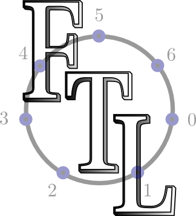

# Finite Transform Library (FTL)


## Introduction
Fast Than Light Transforms which provide Radon and Number Theoretic Transforms within the geometry of the Discrete Fourier Transform (DFT)

The library has two implementations. The original C implementation and the newer Python Implementation.

C implementation features:
- NTTW Sub Library for Number Theoretic Transforms, high resolution (microsecond) timing, basic array and imaging
- FRTW Sub Library for Discrete Radon Transforms (DRTs), Mojette Transforms, Discrete Fourier Transforms (DFTs) via FFTW

Python implementation features:
- Work in progress. Check back for updates.

## Features
* Number Theoretic Transforms
* High Resolution Timing
* PGM Imaging
* Discrete Radon Transforms
* Rader Transforms
* Mojette Transform
* Ghosts
* Discrete Fourier Slice Theorem
* Discrete Radon Transforms

## Build
```
mkdir build
cd build
ccmake .. OR cmake-gui
make OR ninja
```

## Scientific Publications
Chandra, S. S.; Svalbe, I.; Guedon, J.; Kingston, A. & Normand, N.  
"[Recovering Missing Slices of the Discrete Fourier Transform Using Ghosts](http://ieeexplore.ieee.org/xpl/articleDetails.jsp?arnumber=6226457)"  
<span style="font-weight: bold;">Image Processing, IEEE Transactions on</span>, 2012, 21, 4431 -4441  
DOI: [10.1109/TIP.2012.2206033  
](http://dx.doi.org/10.1109/TIP.2012.2206033)FTL Module: <span style="font-weight: bold;">FRTW/ghosts</span>

Chandra, S. S.; Normand, N.; Kingston, A.; Guedon, J.; Svalbe, I.  
"[Robust digital image reconstruction via the discrete Fourier slice theorem](http://ieeexplore.ieee.org/xpls/abs_all.jsp?arnumber=6777574&tag=1)"  
<span style="font-weight: bold;">Signal Processing Letters, IEEE</span>, 2014, 21(6), 682-686  
DOI: [10.1109/LSP.2014.2313341](http://dx.doi.org/10.1109/LSP.2014.2313341)  
FTL Module: <span style="font-weight: bold;">FRTW/mojette</span>

Chandra, S. S.; Svalbe, I.  
"[Exact image representation via a number-theoretic Radon transform](http://ieeexplore.ieee.org/xpls/abs_all.jsp?arnumber=6847269)"  
<span style="font-weight: bold;">Computer Vision, IET</span>, 2014, 8(4), 338-346.  
DOI: [10.1049/iet-cvi.2013.0101](http://dx.doi.org/10.1049/iet-cvi.2013.0101)  
FTL Module: <span style="font-weight: bold;">FRTW/radon</span>

## Licensing
This library is available under the terms of the Lesser GNU Public License v3.
